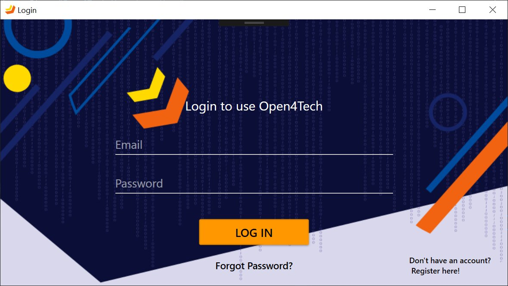
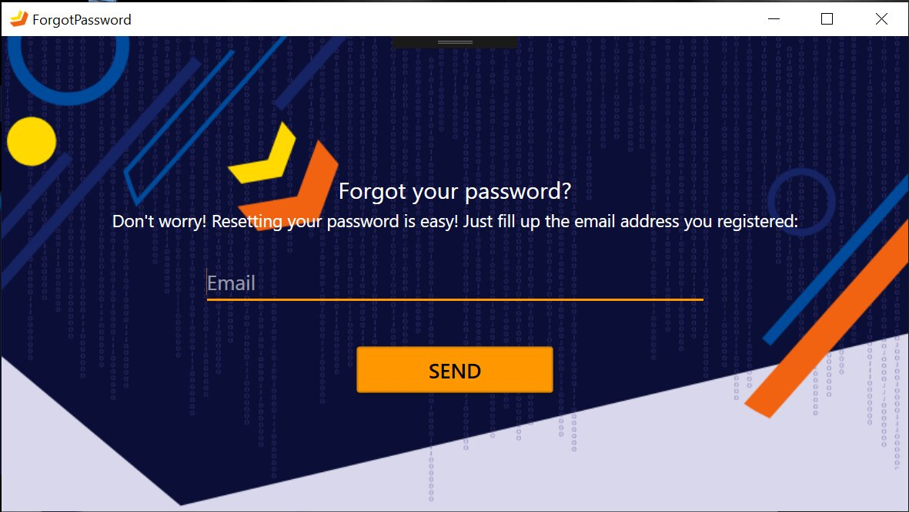

# Classic Login Application
## Open4Tech WPF App
- WPF Application
- Design based on **Open4Tech Presentation ([Windows App Development with .NET WPF](https://www.caphyon.ro/open4tech-2019-windows-app-development-with-dotnet-wpf.html))** by [Caphyon](https://www.caphyon.ro)

### Login Page
The application allows you to access the homepage by  logging in.

### Register Account
If you do not have an account, you can create one by accessing the register option (the bottom right corner). In order to register, you must enter your email and a password. Please make sure that your email is correctly written, because **you'll receive a confirmation code via email**.

### Verify Email
Enter the code you received in order to confirm your email, and that's all! now you can log in!

### Forgot your password?
If you forgot your password, you can reset it in a similar way, by entering a confirmation code sent via email.

### The End
Key words:
- Visual Studio
- WPF
- MVVM
- Caliburn.Micro
